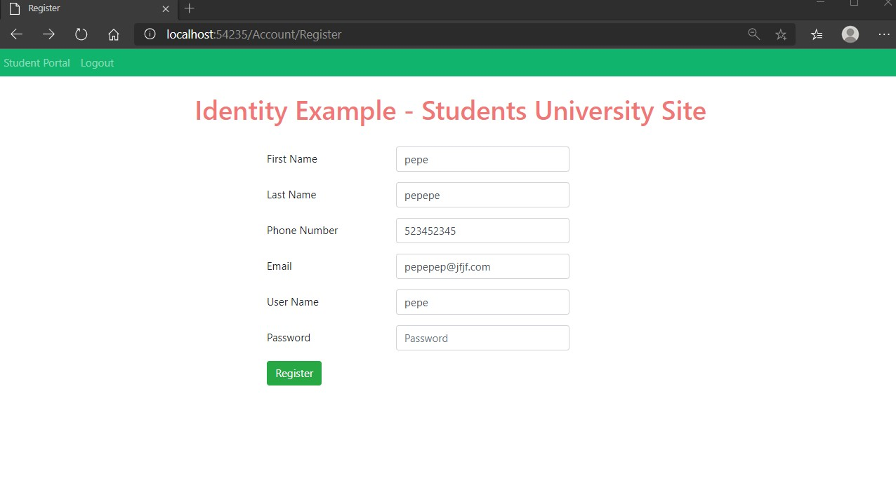
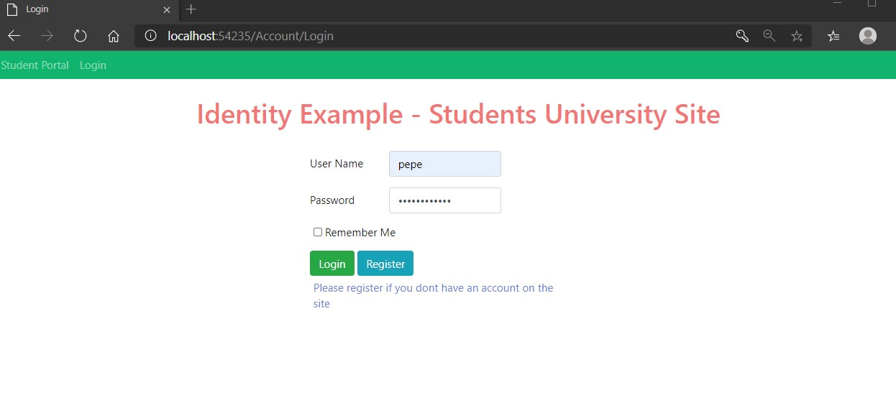
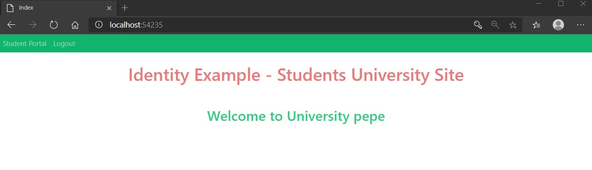

# Tareas del MOC

## Module 11: Managing Security

# Lesson 1: Authentication in ASP.NET Core 

### Demonstration: How to use ASP.NET Core Identity

- Instalamos las dependencias desde la consola

- Completamos el middleware para que acepte la autenticacion

- En el StudentController Redirige la pagina al login si no esta logado el usuario

- Crear el AccountController y añadirle las acciones de login, register y el constructor

- EJecutamos

  

